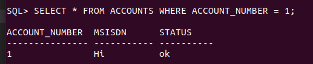
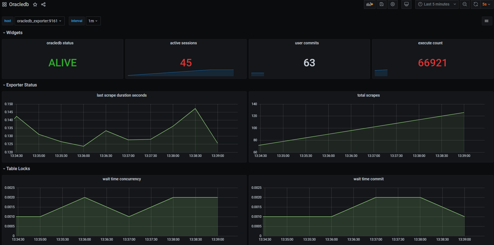

# oracle_test

## Инструкция запуска

- Скачиваем репозиторий и заходим в директорию `oracle_test`:

  `git clone https://github.com/streetstorm/oracle_test.git && cd oracle_test`

- Скачиваем с оффициального сайта oracle архив в папку `oracle12c`:

  https://www.oracle.com/database/technologies/oracle12c-linux-12201-downloads.html

- Собираем все образы:

  `make build_all`

- Создаем папку для volume базы данных:

  `mkdir ~/oradata && chmod a+w ~/oradata`

- Запускаем контейнер базы данных и ждём, когда статус контейнера будет `healthy`:

  `make run_oracle`

  либо:

```shell
docker run -d --name oracle -p 1521:1521 -e ORACLE_PWD=oracle -v /home/$(USER)/oradata:/opt/oracle/oradata oracle12
```

- Заходим в контейнер oracle и делаем SELECT по первичному ключу в созданную таблицу(которую создал скрипт при запуске БД):

```shell
docker exec -ti oracle sqlplus sus/oracle@localhost/ORCLPDB1

SELECT * FROM ACCOUNTS WHERE ACCOUNT_NUMBER = 1;

exit
```

​

- Запускаем мониторинг:

`make run_monitoring`

  либо по очереди:

```shell
# Экспортер (make run_exporter)
docker run -d --name oracledb_exporter --link=oracle -p 9161:9161 -e DATA_SOURCE_NAME=system/oracle@oracle/ORCLCDB oracledb_exporter
# Prometheus (make run_prometheus)
docker run -d -p 9090:9090 --name prometheus --link=oracledb_exporter prometheus
# Grafana (make run_grafana)
docker run -d -p 3000:3000 --name grafana --link=prometheus grafana
```

- Открываем браузер, заходим в Grafana `http://localhost:3000`, логин и пароль по умолчанию(admin:admin). Data Source и Dashboard уже преднастроенны, достаточно перейти в раздел `Search` и открыть dashboard: Oracledb.

​
